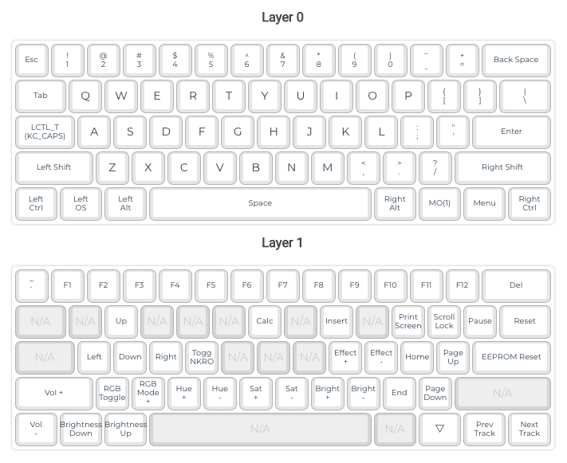

# QMK_Configurations
This repo contains my custom QMK keyboard configurations.

* DZ60 RGB ANSI (two layers)
  - Layer 0: Default ANSI layout.
  - Layer 1: Arrow keys, RGB controls, multimedia & function keys.

  (Based in [QMK -> dztech/dz60rgb_ansi/v1](https://config.qmk.fm/#/dztech/dz60rgb_ansi/v1/LAYOUT_60_ansi))

  